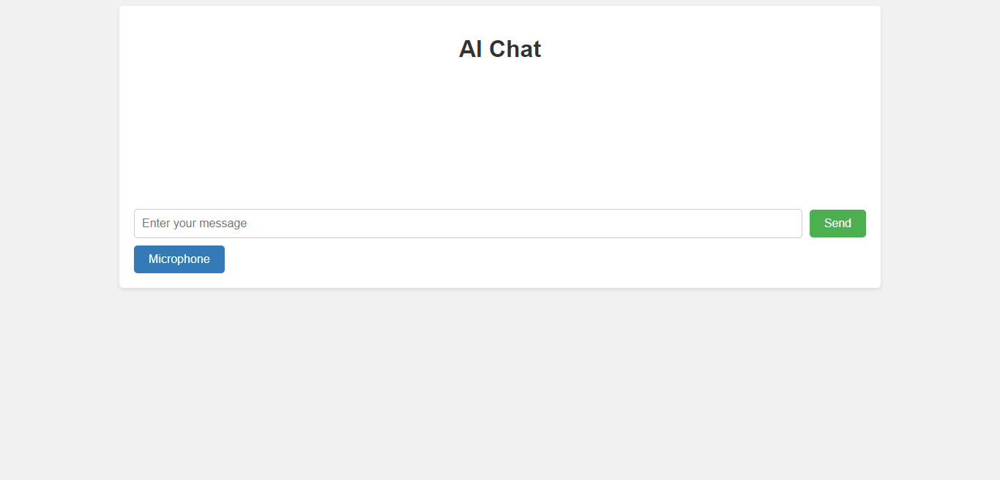

### Installation

1. Fork the repo (GitHub repository)
2. Clone the forked repo
`git clone https://github.com/oksanaaam/ai_assistant.git`
3. Open the project folder in your IDE
4. Open a terminal in the project folder
5. If you are using PyCharm - it may propose you to automatically create venv for your project and install requirements in it, but if not:
```
python -m venv venv
venv\Scripts\activate (on Windows)
source venv/bin/activate (on macOS)
pip install -r requirements.txt
```

Also, you need install some required libraries and other dependencies:
```
pip install openai
pip install Django
```


### Set the environment and get an API key.
Set the required environment variables in .env.sample file:

How do I get an API key for Chat GPT?
  Go to https://chat.openai.com/auth/login, and click the "Sign up" button to create an OpenAI account.
  Once you successfully create an account, log in to it.
  Apply for API access by going to the API keys page and clicking the "Create new secret key" button.

```
SECRET_KEY=<your SECRET_KEY>
ALLOWED_HOSTS=<your ALLOWED_HOSTS>
DEBUG = <your debug>

OPENAI_API_KEY = <your OPENAI_API_KEY>
```

### Run server
```
python manage.py migrate
python manage.py runserver
```

### Features
• This project is a web application that uses the OpenAI GPT-3.5 
modeling language to provide artificial intelligence and chat support.

• You can interact with the model by sending text messages and receiving responses based 
on the patterns and knowledge the model has accumulated during training.

• The project has a user interface where you can enter your questions and get answers in real time. 
It is also possible to use the microphone to enter voice questions.

• The project saves previous conversations and displays them,
so you can review previous questions and answers.

Some photo to see how chat look like
